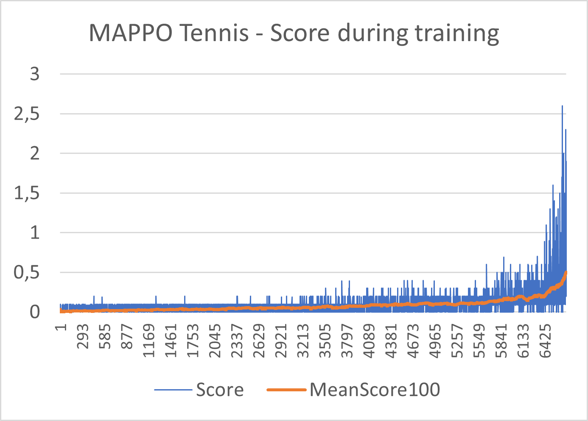

# Project Report

### Learning Algorithm

The **Multi-Agents PPO (MAPPO) algorithm** was used to solve this project.

The basic PPO algorithm is an on-policy algorithm, from the family of policy gradient methods, that is able to tackle complex environments, continuous action spaces and distributed training.

In order to leverage it with multiple agents, very few modifications are required.

While training the actor network, each agent only has access to its own observation space, which is equivalent to a parallel training scenario where each agent passes its observations to the same actor network one after the other.

On the other hand, the critic network has access to the observations of all agents at once, and therefore of the whole game state, and is able to infer if the whole game is in a good or bad state.
This critic is accessible to both agent while training, and thus it brings an element of collaboration between them.

#### Hypermarameters :
|Hyperparameter|Value|
|--------------|-----|
|episode | 50000 |
|discount_rate | .99 |
|tau | 0.95 |
|surrogate_clip | 0.2 |
|surrogate_clip_decay | 1 |
|beta | 1e-2 |
|beta_decay | 1 |
|n_epoch | 4 |
|learning_rate | 1e-4 |
|adam_epsilon | 3e-4 |
|batch_size | 128 |
|hidden_size | 128 |
|gradient_clip | 5 |
|rollout_size | 1280 |

#### Neural networks

Two distinct neural networks were used for this task. \
The actor network takes as input 3 stacked states for a total size of 24, passes trough 3 dense layers of size 128, and ends with a tanh activation multiplied by 2 to better tailor around the range of the continuous action values. \
The critic network takes as input the observations of both agents, for a total size of 48, in order to help infering the situation of the whole game.
It then passes through 3 layers of size 128, and ends with a single value output without activation.

In both cases, an adam optimizer is used to train the neural networks.

##### Actor neural network structure :

| Layer | type | Input size | Output size | Activation |
|-------|------|------------|-------------|------------|
|1 | Fully Connected | 24 (3x stacked state size) | 128 | ReLU |
|2  | Fully Connected | 128 | 128 | ReLU |
|3 | Fully Connected | 128 | 128 | ReLU |
|4  | Fully Connected | 128 | 2 (action size) | 2*tanh |

##### Value neural network structure :

| Layer | type | Input size | Output size | Activation |
|-------|------|------------|-------------|------------|
|1 | Fully Connected | 48 (observations of both agents) | 128 | ReLU |
|2  | Fully Connected | 128 | 128 | ReLU |
|3  | Fully Connected | 128 | 128 | ReLU |
|4 | Fully Connected | 1024 | 1 | None |

##### Other parameters
`self.std = nn.Parameter(torch.ones(1, action_size))`

### Plot of rewards

In **6608** episodes, the game was solved by achieving an average score of at least +0.5 over the next 100 episodes.

### Ideas for future work

It would be interesting to test the MADDPG algorithm, and compare its performance against the actual MAPPO algorithm.

Also, most hyperparameters stayed the same between the previous project (Reacher) and this one. Which opens the question of how the structure of a model can easily transpose to another project given relatively similar complexity with state sizes and action sizes. It would be something interesting to further investigate.

Regarding learning speed, even if over 6600 episodes were required, each episode is relatively short, and the whole training time was about 1 hour on an RTX3080 GPU + AMD Ryzen 7 3800XT CPU. Playing with neural net structures and compare the different learning speeds would be relevant to gain more intuition on the matter. 
